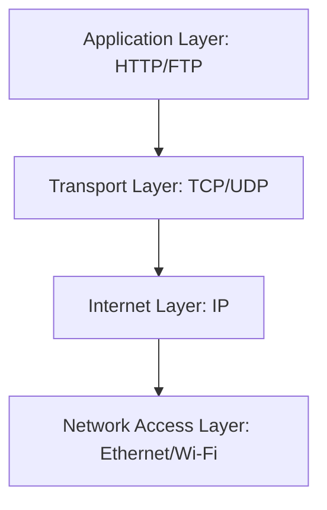

# 🌐 Introduction to Networking

Networking can be expressed simply as **two or more machines exchanging data frames using a protocol**.  
In Ubuntu (and Linux in general), networking is handled by the **kernel network stack** which implements the TCP/IP model.

---

## 🔹 Main Components of a Simple Network

- **Machine Sender**
- **Machine Receiver**

> Each machine has a **Network Interface Card (NIC)** (a hardware chip responsible for sending/receiving frames).  
> Connections between machines can be:
- **Direct** (point-to-point).
- **Indirect** (through routers, switches, or servers).

```mermaid
flowchart LR
    A[Sender Machine] --Direct / Indirect--> B[Receiver Machine]
````

---

## 🔹 Internet Network Components

* **Network Interface Card (NIC)**

  * Each NIC has a unique identifier called a **MAC Address**.

* **Router**

  * Assigns **local network IPs** (via DHCP).
  * Forwards traffic to/from public networks (Internet).

* **Server**

  * Hosts services and responds to client requests.
  * Can be public (web server, database server, etc.).

```mermaid
flowchart TD
    PC1[PC / Laptop] --> R[Router]
    PC2[PC / Laptop] --> R
    R --> ISP[Internet Service Provider]
    ISP --> Server[Web Server / App Server]
```

---

## 🔹 How an Ethernet Frame is Constructed

To understand Ethernet frames, we must first understand the **TCP/IP model**.
This model is implemented in the **Linux Kernel network stack**.

* Data is often transmitted using **Application Layer protocols** (e.g., HTTP).
* Each layer of the TCP/IP stack adds its own header until the final **Ethernet frame** is constructed.

### 📚 TCP/IP Model Layers

1. **Application Layer**

   * Implements application protocols (HTTP, FTP, DNS, etc.).
2. **Transport Layer**

   * Provides reliable/unreliable transport (TCP/UDP).
3. **Internet Layer**

   * Handles addressing and routing (IP).
4. **Network Access Layer**

   * Defines how frames are transmitted physically (Ethernet, Wi-Fi).



---

## 🔹 Useful Commands in Linux Networking

### 1. Show Network Interface Details

```bash
ifconfig -a
```

* Disable an interface:

```bash
ifconfig <interface_name> down
```

* Enable an interface:

```bash
ifconfig <interface_name> up
```

---

### 2. Scan All Machines in a Subnet

```bash
nmap -sn <subnet>/24
```

---

### 3. Show All Open Sockets

```bash
ss
ss -t # to show the connected devices to you machine.
```

---

### 4. Check Connectivity

* Ping another host:

```bash
ping <ip_address>
```

* Access a remote machine via SSH:

```bash
ssh user@ip_address
```

---

## 📌 Summary

* Networking = **Machines + Protocols + Connections**.
* Every NIC has a **MAC Address** (hardware ID).
* The **Router** assigns local IPs and connects to the Internet.
* Data transfer follows the **TCP/IP stack**.
* Linux provides multiple commands (`ifconfig`, `nmap`, `ss`, `ping`, `ssh`) to manage and debug networking.

---
Got it, Magdi ✅. Here’s the **Ethernet Frame Construction (Encapsulation)** explained in **English only**, formatted in Markdown for clarity.

---

# 🧩 Ethernet Frame Construction (Encapsulation)

## Diagram
```mermaid
flowchart TB
    D[Application Data (HTTP Request)] --> T[+ TCP/UDP Header]
    T --> I[+ IP Header]
    I --> E[+ Ethernet Header & Trailer]
    E --> F[Final Ethernet Frame]
````

---

## Explanation

1. **Application Data (HTTP Request)**

   * This is the raw data generated by the application, e.g., a web request or file transfer.

2. **Transport Layer (TCP/UDP Header)**

   * Adds **port numbers** (source and destination).
   * Ensures data delivery reliability (TCP) or speed with no guarantee (UDP).

3. **Internet Layer (IP Header)**

   * Adds **IP addresses** (source and destination).
   * Responsible for routing the packet across different networks.

4. **Network Access Layer (Ethernet Header & Trailer)**

   * Adds **MAC addresses** for the sender and receiver.
   * Includes an **error-checking mechanism** (Frame Check Sequence).
   * This layer prepares the frame for physical transmission over Ethernet or Wi-Fi.

5. **Final Ethernet Frame**

   * The complete encapsulated unit that travels across the network medium.
   * When it reaches the destination, each layer removes its header and passes the data up to the next layer until the application data is retrieved.

   ---


# 🔑 SSH Command Guide

## 📌 What is SSH?
SSH (**Secure Shell**) is a protocol to securely connect to and manage remote machines.  
It allows encrypted communication for login, file transfer, and command execution.

---

## 1. Basic SSH Login
```bash
ssh user@ip_address
````

* Example:

  ```bash
  ssh mmagdi@192.168.8.52
  ```
* Connects to the remote machine with your username.

---

## 2. Specify Port

By default, SSH uses port `22`. If the server uses another port:

```bash
ssh -p 2222 user@ip_address
```

---

## 3. Run a Command on Remote

```bash
ssh user@ip_address "uptime"
```

* Executes `uptime` on the remote machine.
* Closes the session after execution.

---

## 4. Run a Command, Then Stay Logged In

```bash
ssh user@ip_address "echo 'Hello Magdi'; exec bash -l"
```

* Prints a message, then keeps the shell open.

---

## 5. Copy Files to Remote (Upload)

```bash
scp localfile.txt user@ip_address:/remote/path/
```

* Example:

  ```bash
  scp notes.txt mmagdi@192.168.8.52:/home/mmagdi/
  ```

---

## 6. Copy Files from Remote (Download)

```bash
scp user@ip_address:/remote/path/file.txt /local/path/
```

* Example:

  ```bash
  scp mmagdi@192.168.8.52:/etc/hosts ./hosts_backup
  ```

---

## 7. Copy Entire Directory

```bash
scp -r /local/folder user@ip_address:/remote/path/
```

---

## 8. Use Key Authentication (No Password)

1. Generate a key on your local machine:

   ```bash
   ssh-keygen -t rsa
   ```
2. Copy it to the remote server:

   ```bash
   ssh-copy-id user@ip_address
   ```
3. Now you can log in without typing a password:

   ```bash
   ssh user@ip_address
   ```

---

## 9. Create a Tunnel (Port Forwarding)

Forward a local port to remote service:

```bash
ssh -L 8080:localhost:80 user@ip_address
```

* Access the remote machine’s web service (port 80) locally on `http://localhost:8080`.

---

## 10. Proxy / Jump Host

If you must connect **through another server**:

```bash
ssh -J user@jump_host user@final_destination
```

---

## 11. Keep Session Alive

Prevent disconnects by adding:

```bash
ssh -o ServerAliveInterval=60 user@ip_address
```

(Sends a keep-alive packet every 60s.)

---

## 12. Save Configurations (Shortcut)

Edit `~/.ssh/config`:

```
Host myserver
    HostName 192.168.8.52
    User mmagdi
    Port 22
```

Now connect simply with:

```bash
ssh myserver
```

---

## 13. Debugging SSH

If connection fails:

```bash
ssh -v user@ip_address
```

* Shows detailed debug output.

---

# ✅ Summary

* **Login:** `ssh user@ip`
* **Command Execution:** `ssh user@ip "command"`
* **File Transfer:** `scp file user@ip:/path/`
* **Keys:** `ssh-keygen` + `ssh-copy-id`
* **Advanced:** tunneling, jump hosts, config file

This cheat sheet should cover **90% of SSH use cases** for daily work.


---


